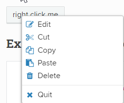

// We must enable experimental attribute.
:experimental:
:icons: font

// GitHub doesn't render asciidoc exactly as intended, so we adjust settings and utilize some html

ifdef::env-github[]

:tip-caption: :bulb:
:note-caption: :information_source:
:important-caption: :heavy_exclamation_mark:
:caution-caption: :fire:
:warning-caption: :warning:
endif::[]

= Advanced clicking

While Pacewords *ClickText* and *ClickElement* are extremely useful and are used in almost all test cases, there are sometimes needs to do more "advanced" clicking. In this chapter we will take a look at other Pacewords related to clicking:

* <<RightClick>>
* <<ClickUntil>>
* <<ClickWhile>>

== RightClick

Some more complex web applications implement their own right-click context menu. This usually can't be opened with normal (left) clicks using *ClickText* or *ClickElement* keywords. To open a right-click context menu, you need to use keyword *RightClick*. It needs at least one argument, the locator with which to find the element to right-click. The locator can be either *xpath* or, if additional *tag* argument is given, value of one of the element's attributes.

WARNING: At the time of writing plain text can not be used as a locator for this Paceword.

As an example we will use public page demonstrating jQuery context menus: 
https://swisnl.github.io/jQuery-contextMenu/demo.html

On the page there is a button (with text "right click me") which opens context menu when right-clicked. 
[.left]

{empty} +
{empty} +
{empty} +
{empty} +
{empty} +
{empty} +
{empty} +
{empty} +

When looking at the element's html source it looks like this:

[source, html]
----

right click me

----

We can right-click it by

* ...using xpath as a locator

[source, robotframework]
----
*** Settings ***
Library                     QWeb

*** Test Cases ***
Opening context menu by xpath
    OpenBrowser             https://swisnl.github.io/jQuery-contextMenu/demo.html   chrome
    RightClick              //span[text()\="right click me"]
    ClickText               Quit            tag=span
----

* ...specifying a tag and use one of the element's attributes

[source, robotframework]
----
*** Settings ***
Library                     QWeb

*** Test Cases ***
Opening context menu by xpath
    OpenBrowser             https://swisnl.github.io/jQuery-contextMenu/demo.html   chrome
    RightClick              btn-neutral     tag=span
    ClickText               Quit            tag=span
----

TIP: https://help.pace.qentinel.com/pacewords-reference/current/pacewords/interaction/rightclick_qweb.html[Paceword documentation: Right-click]

'''

== ClickUntil

In some complex, heavily integrated web applications it sometimes takes time before button listeners become active. The symptom for this is that normal *ClickText, ClickItem or ClickElement* keywords correctly click the element, but nothing happens as listener was not yet ready.

For these kind of special cases we have two Pacewords, *ClickUntil* and *ClickWhile*. In this topic we will cover *ClickUntil*.

Here is how *ClickUntil* Paceword works in nutshell:
. It will find the text given as a second argument and click it
. It will check until text given as first argument appears. If it does not, *ClickUntil* will click the first text again.

We will use link:../examples/random.html[this page] as example. You can either right-click it and store it locally or take a note of the url of the page in learning system.

The page is very simple. There is a button "Click Me" which produces random number. In order to click the button *until* number *3* is displayed, we can use *ClickUntil*:

[source, robot framework]
----
*** Settings ***
Library                     QWeb

*** Test Cases ***
Opening context menu by xpath
    OpenBrowser             file://C:/automation/random.html   chrome      # if test page has been store locally to c:\automation folder
    ClickUntil              3           Click Me  timeout=30   interval=1
----

You can also use xref:anchors.adoc[anchors] to guide finding the correct element, control the interval between clicks, control the timeout how long the operation is repeated before failing etc. 

In the above example we have set timeout to be 30 seconds, meaning that if number 3 does not appear in 30 seconds the test case will fail. We also have set 1 second interval between repeated clicks.

https://help.pace.qentinel.com/pacewords-reference/current/pacewords/interaction/clickuntil_qweb.html[Paceword documentation: Click Until]

TIP: Qentinel Pace comes also with *ClickItemUntil* version of this Paceword for elements not having a visual text.

WARNING: Don't overuse *ClickUntil* as workaround for problems in your web application. The root cause of why clicks are not handled correctly should be found out and fixed. These may be a symptom of performance etc. problems!

// TODO: ClickUntil video

'''

== ClickWhile

*ClickWhile* is very similar to *ClickUntil*, except that the logic differs a bit. Instead of checking if certain text appears on a screen and trying again, *ClickWhile* checks that a text disappears from the screen.

Using the exactly same example page as in *ClickUntil* example, we'll pretend that button "Click Me" should be clicked until text "ClickWhile condition was not met" disappears. This can be done with the following script:

[source, robot framework]
----
*** Settings ***
Library                     QWeb

*** Test Cases ***
Opening context menu by xpath
    OpenBrowser             file://C:/automation/random.html   chrome      # if test page has been store locally to c:\automation folder
    ClickWhile condition not met           Click Me  timeout=30   interval=1
----

https://help.pace.qentinel.com/pacewords-reference/current/pacewords/interaction/clickwhile_qweb.html[Paceword documentation: Click While]

'''
link:../README.md[Tutorial index]  |  link:../06/timeouts.adoc[Next]

