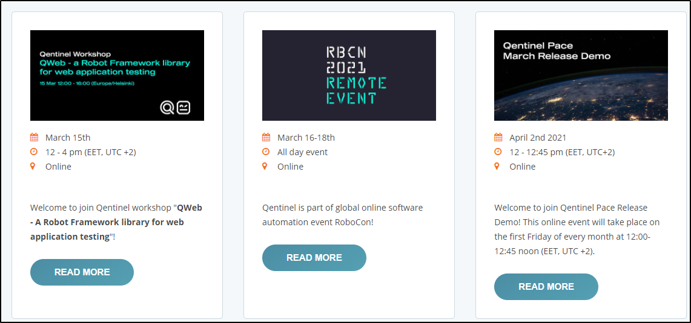

// We must enable experimental attribute.
:experimental:
:icons: font
:toc:

// GitHub doesn't render asciidoc exactly as intended, so we adjust settings and utilize some html

ifdef::env-github[]

:tip-caption: :bulb:
:note-caption: :information_source:
:important-caption: :heavy_exclamation_mark:
:caution-caption: :fire:
:warning-caption: :warning:
endif::[]

= Anchors


== Introduction to anchors
Sometimes webpage contains multiple, duplicated UI texts. While QWeb tries its best to click only elements that are actually clickable, you may face situations where there are duplicated elements and clicks go to the "wrong" one. This is where concept of *anchors* steps in.

In nutshell, anchors are little hints to underlying test execution framework on which of the duplicate elements to select. They work with basically all interaction keywords which uses UI text as a locator (for example ClickText, TypeText etc.)


== Anchor types

Anchors can be either text or numbers.

*Textual anchors* bind text to be found to another text close by. So using for example the following script:

[source, robotframework]
----
ClickText    Login      anchor=Cancel
----

...QWeb tries to find and click text *Login* which is closest to text *Cancel*. 

*Numeric anchors* are positional; QWeb finds nth instance of the element on screen. For example, using the following script:

[source, robotframework]
----
ClickText    Login      anchor=3
----

...QWeb would click third instance of element containing text *Login*.

== Anchor example
We will use https://info.qentinel.com/events[Qentinel's events page] as an example on how to use anchors. At the time of writing, there were these events on the page:
[.left]

{empty} +
{empty} +
{empty} +
{empty} +
{empty} +
{empty} +
{empty} +
{empty} +

If we would want to read more about specific event, say for "RoboCon", we would need to use anchors.

Here is a little example script that would show how to open details of all events:


[source, robotframework]
----
*** Settings ***
Library                     QWeb

*** Test Cases ***
Opening event details
    OpenBrowser             https://info.qentinel.com/events   chrome
    ClickText               READ MORE  # by default Qentinel QWeb clicks the first one

    ClickText               READ MORE  anchor=RoboCon    # opens second one, "RoboCon", using textual anchor

    ClickText               READ MORE  anchor=2        # opens second one, "RoboCon", using numeric anchor

    ClickText               READ MORE  anchor=Release Demo        # opens second one, "March Release Demo", using numeric anchor
----

NOTE: Example above omits all verifications or navigating back to previous page.

TIP: Using textual anchors is preferred at least in lists and tables where item position can frequently change.

'''

== Other means of selecting specific element

In addition to "anchors", many key allow specifying the HTML tag for the element we should be interacting with, it's parent tag or it's child tag. This is especially useful if there are multiple items with same text or other attribute, but with different tags. Or, if the text attribute is actually either a child or parent of the element which reacts to clicks.

The above can be done with *tag*, *parent* or *child* arguments. Please check each keyword's documentation to find out which of these it supports. 

There will be examples about this later, in link:../05/clicking_advanced.adoc#RightClick[Advanced Clicking] and in link:../10/tables.adoc#ClickCell[Table keywords] chapters using *tag* argument.


## Exercise

Build on top of the example above. Use the same Qentinel's event page.

. Go to https://info.qentinel.com/events
. Click "READ MORE" on event "Qentinel Pace Release Demo" using anchor
. Verify that text "Monthly demo series demonstrates the main features of the latest Qentinel Pace release" appears on detailed info page.

### Solution

Exercise example solution can be found the repo. Please try to implement your own solution first before looking at the provided solution.

Run this solution from repo root by:
```
robot ./07/07_solution.robot 
```

'''
link:../README.md[Tutorial index]  |  link:../08/alerts.adoc[Next]