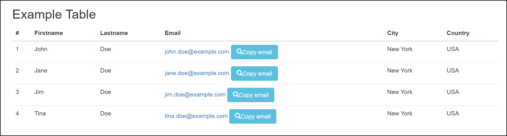

// We must enable experimental attribute.
:experimental:
:icons: font
:toc:

// GitHub doesn't render asciidoc exactly as intended, so we adjust settings and utilize some html

ifdef::env-github[]

:tip-caption: :bulb:
:note-caption: :information_source:
:important-caption: :heavy_exclamation_mark:
:caution-caption: :fire:
:warning-caption: :warning:
endif::[]

= Table keywords

== Introduction to tables

Many complex web applications (for example web UIs of SAP, Siebel, Salesforce etc.) rely heavily on tables to display elements on a page. While we can certainly just click texts or elements in a table, QWeb comes with built-in capabilities to work with tables more efficiently.


== Table Keywords

Here are the most relevant html table related keywords at the time of writing:

* UseTable
* GetTableRow
* GetCellText
* VerifyTable
* ClickCell

You can check all table related keywords https://help.pace.qentinel.com/pacewords-reference/current/pacewords/table.html[here]

=== UseTable
Before we start working with table contents we must "focus" on certain table. This will limit the search to certain table and is especially useful in these web applications that have multiple tables on a same page. To focus on certain table, you should use keyword *UseTable* and give some text from the table as argument. Usually one of the headers is a good choice OR if table contents is known, some value from a table row/cell.

With an example table like this:
[.left]

{empty} +
{empty} +
{empty} +

...we would focus on this particular table like this:

[source, robotframework]
----
UseTable        Firstname
# OR using a table cell value:
UseTable        Jane
----

After focusing to a table, all table related keywords will work with that particular table until changed to another table.

TIP: Focusing to a table is easiest with some text on a table, but xpath's work too.

NOTE: A "table" does not necessarily look like a table in a web page. You can use Qentinel Pace's table related keywords always when there's <td> tags as a parent for the element you want to interact with.

=== Example table
link:../examples/table.html[Here] is a .html page that contains this example table. Use this as playground for exercises below. 

=== GetTableRow

To get index of a row containing specific item or getting the rowcount of a table, you can use keyword *GetTableRow*.

==== Row containing text
To get a row containing specific text, include the text as an argument. With the example table if we want to get the row containing name *Jim*, we can use:

[source, robotframework]
----
${row}=     GetTableRow     Jim
----


==== Last row syntax

To get the rowcount of a table (i.e. last row's index), we can use special locator syntax _*//last*_ as an argument.
[source, robotframework]
----
${row}=     GetTableRow     //last
----

==== Skipping headers

The row index returned by *GetTableRow* _includes_ table header row. This is not how most people refer to table rows, i.e. the first actual content row would be 2.

To override this behavior,  GetTableRow can be instructed to omit header row from the returned value. This can be done with *skip_header* argument. When setting this argument to *True*, row index is returned without including the header row.

If you try the previous two examples with *skip_header=True* and compare the results to previous run, you can see the difference:

[source, robotframework]
----
${row}=     GetTableRow     //last                        # returns 5
${row}=     GetTableRow     //last    skip_header=True    # returns 4
...
${row}=     GetTableRow     Jim                           # returns 4
${row}=     GetTableRow     Jim    skip_header=True       # returns 3
----


=== GetCellText
You can use keyword *GetCellText* to get the value stored in specific cell. Use special cell coordinates syntax to identify exact table cell using row/column combination.

==== Cell coordinates syntax

To focus on specific table cell, you can use format ```r[row_number]c[column_number]```. While this may look a bit intimidating, the format is quite straight-forward. You just give *r*ow and *c*olumn numbers.

So, to get first name from first row in our example table, one would use:
[source, robotframework]
----
${cell_value}=     GetCellText     r1c2  # Returns "John", first name is column 2.
----

Python style -1 as row number will also point to the last row:
[source, robotframework]
----
${cell_value}=     GetCellText     r-1/c2  # Returns "Tina", -1 points to last row
----

...-2 would point to second last row and so on.

WARNING: When using *GetTableRow* and *GetCellText* one after another, take into account that GetCellText *does not* include header row; r1 points to the first real content row.

What if we know one expected value existing somewhere in the table, but we don't know it's position on the table? Then we can use wildcard format with *?* -character and search by another text in that row:
[source, robotframework]
----
${cell_value}=     GetCellText     r?jim.doe@example.com/c2  # Returns "Jim", r?jim.doe@example.com finds the row index based on word "Jim"
----

In some tables columb order can be changed too, so you may need to identify column based on header text, not index:
[source, robotframework]
----
${cell_value}=     GetCellText     r?jim.doe@example.com/c?FirstName  # Returns "Jim", r?jim.doe@example.com finds the row index based on word "Jim" and c?Firstname finds column index by header text "Firstname"
----

NOTE: Cell coordinate syntax works with most table keywords and it can be used with some other keywords too. Please refer to individual keyword's documentation to find out if this format is supported.

=== VerifyTable

If you are not interested in storing the value from a table cell and using it later in your test case, you can just verify that the value is as expected. This can be done with keyword *VerifyTable*

[source, robotframework]
----
VerifyTable     r3c2      Jim   # Fails if cell content on row 3, column 2 is not "Jim"
----

=== ClickCell

To click cell (or another element embedded in a cell) you can use keyword *ClickCell*. There nothing too special in this keyword, i.e. it works like you would expect it to. *ClickCell* works with the same cell coordinate syntax as other table related keywords, so to click second cell in second row one would use something like this:

[source, robotframework]
----
ClickCell     r2c2
----

Note that if the cell does not include any clickable action/element, then the cell itself is clicked. This may not be obvious if nothing happens, but I'm highlighting this as it's not supposed to fail in this case.

There is one exception where things might get a bit more complicated; in certain implementations there may be multiple clickable elements embedded inside one cell. 

We have tried to simulate this situation in our example table on column 4. It contains users email address as a clickable link and fake button "Copy email".

If you would just click this cell in normal way, for example
[source, robotframework]
----
ClickCell     r2c4
----

...most probably one of these elements would receive the click. Which one depends on the implementation. To be specific which element is going to be clicked one can use *tag* argument:

[source, robotframework]
----
ClickCell     r2c4      tag=a        # clicks email address
ClickCell     r2c4      tag=button   # clicks button and displays alert
----

== Exercise: Working with tables

Using the example table in the html file attached earlier in this lesson, please do the following exercise:

. Focus on the table using *UseTable*
. Get the amount of rows in a table including headers
. Get the amount of rows in table excluding headers
. Find row index for row that contains text *Jane*. Do not include headers!
. Get the first name on third row.
. Verify that the first name on second row is "Jane"
. Click "Copy email" button in row that contains word "John"

+++ <details><summary> +++
Check exercise solution *after* trying by yourself:
+++ </summary><div> +++
[source, robot framework]
----
*** Settings ***
Library                     QWeb

*** Test Cases ***
Table exercises
    OpenBrowser             file://${CURDIR}/../examples/table.html   chrome      # if test page has been store locally to c:\automation folder
    # 1 - Focus on the table using *UseTable*
    UseTable    Firstname

    #2 - Get the amount of rows in a table including headers
    ${rows}=    GetTableRow     //last

    #3 - Get the amount of rows in table excluding headers
    ${rows}=    GetTableRow     //last  skip_header=True

    #4 - Find row index for row that contains text *Jane*. Do not include headers!
    ${rows}=    GetTableRow     Jane    skip_header=True

    #5 - Get the first name on third row.
    ${first_name}=    GetCellText    r3c2

    #6 -Verify that the first name on second row is "Jane"
    VerifyTable  r2c2   Jane

    #7 - Click "Copy email" button in row that contains word "John"
    ClickCell   r?John/c4      tag=button

----

Run this solution from repo root by:
```
robot ./10/solution_10.robot 
```
+++ </div></details> +++


'''
link:../README.md[Tutorial index]  |  link:../11/appstate_teardown.adoc[Next]