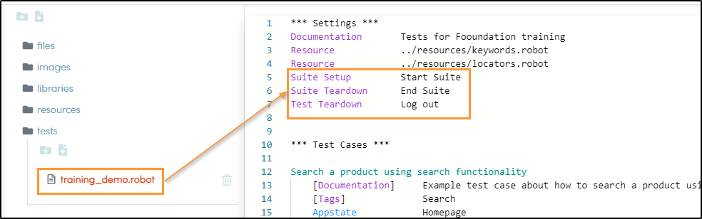

// We must enable experimental attribute.
:experimental:
:icons: font
:toc:

// GitHub doesn't render asciidoc exactly as intended, so we adjust settings and utilize some html

ifdef::env-github[]

:tip-caption: :bulb:
:note-caption: :information_source:
:important-caption: :heavy_exclamation_mark:
:caution-caption: :fire:
:warning-caption: :warning:
endif::[]

= Appstates & Teardowns

Qentinel Pace supports *Appstate* definition to handle making sure application is in correct state before actual testing starts. *Suite Setup* and *Suite Teardown* handle actions that are needed to be done before suite execution starts or after the execution ends.

== Appstate

*Appstate* is usually the first keyword in every test case. It should handle all preconditions for a test case, i.e. make sure that when the actual testing starts, we know exactly what is the state of the application.

As an example, if you are testing _shopping cart_ functionality in a web application and need to validate that the amount of items in a cart match to expected value, then you should make sure in your appstate that shopping cart is in know state (usually no items in shopping cart) prior to executing rest of the test case. 

Due to nature of differences in applications Appstates are usually keywords that test automator has to define by himself/herself. Custom keywords are defined in *resources* file.  Here is one example of the Appstate structure:

In resource file (for example _./resources/keywords.robot_) create a custom keyword for Appstate implementation:

[source,robotframework]
----
Qentinel_Global
    [Documentation] 	Navigates to Qentinel Finnish homepage
    GoTo                https://qentinel.com/
    VerifyText          Plans
    VerifyText          Open source

Qentinel_DE
    [Documentation] 	Navigates to Qentinel German homepage
    GoTo                https://qentinel.com/de/
    VerifyText          Einloggen
----

Then, in your test cases you could make sure correct language specific pages are open by calling the Appstate:

[source,robotframework]
----
Test the global home page
[Documentation]     Accepts the cookie policy, changes the 
...        location to 'Global' and verifies home page text.
    [Tags]              Home
    Appstate            Qentinel_Global
    VerifyText          Add superpowers to software testing
----

[source,robotframework]
----
Test the global home page
[Documentation]     Accepts the cookie policy, changes the 
...        location to 'Global' and verifies home page text.
    [Tags]              Home
    Appstate            Qentinel_DE
    VerifyText          Statten Sie Softwaretests mit Superkräften aus
----

Usually Appstates are used for example to login to application on web or making sure certain dialog or view is open on native/mobile applications.

NOTE: More about Appstates in xref:pacewords-reference::index_pacewords.adoc[PaceWords reference]

== Suite/Test Setup and Teardown

Use *Suite Setup/Teardown* to handle conditions that will be done once per test suite. 
For example:

* opening/closing browser
* loading test data etc.

Use *Test Setup/Teardown* to handle conditions that will be done once per test case, for example logout or loading test data specifically for one test case.



The keyword implementation for the above suite setup/teardown and test setup would probably look something like this (would defined in _.\resources\keywords.robot_):

[source,robotframework]
----
Log out
    [Documentation] 	Logs out from example.com
    ClickText           Profile
    ClickText           Log out
    VerifyText          Sign in

Start Suite
    [Documentation] 	Prepares browser and sets common settings
    OpenBrowser         https://www.example.com    chrome
    SetConfig           DefaultTimeout      5s     # sets default timeout to 5 secs

End Suite
    [Documentation] 	Teardown actions
    CloseAllBrowsers
----

## Exercise

As an execise we will create a script which will fill in the contacts page in https://qentinelqi.github.io/shop/ according to information given in this screenshot:


{empty} +
{empty} +
{empty} +
{empty} +
{empty} +
{empty} +
{empty} +
{empty} +

. Opening browser is done on *Suite Setup*
. Closing broser is done on *Suite Teardown*
. Navigating to contacts page is done on *Appstate    Contact*

### Solution

Exercise example solution can be found the repo. Please try to implement your own solution first before looking at the provided solution.

Run this solution from repo root by:
```
robot ./11/solution_11.robot 
```

'''
link:../README.md[Tutorial index]  |  link:../12/debugging.adoc[Next]