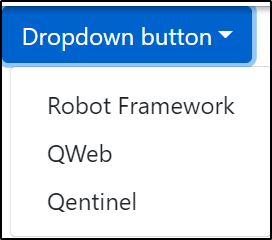

= Extending QWeb

While QWeb should work directly with most web elements, there may be sometimes custom functionality which makes things harder than they should be. Common examples is very deeply structured tables or dropdown lists, which are not using *<select>* and *<option>* tags that QWeb's *DropDown* keywords expects.

This chapter introduces two ways of extending keywords, either by reusing functionality provided by QWeb or creating own functionality from scratch.

QWeb keywords can be extended by:

* Creating User Defined Keywords using Robot Framework syntax
* Creating own keywords using Python

Let's take a look at both of these options in detail.

== Creating own Robot Framework keywords

Custom keywords are defined in a _resource_ file. The suggested structure in Qentinel Pace is that resource files are stored in *resources* folder in your project. Since we aim to keep the amount of custom keywords low, usually just one file, *keywords.robot* is enough. You can of course name the file anything else or have keywords for different areas of the application in different files, but we would suggest starting with a simple structure. The more files and keywords you have, the more you end up spending time finding correct place to modify if changes are needed.

It's common to move the importing of needed libraries to *keywords.robot* file, especially if your custom keywords are being used in every test suite. The section headers you need in keywords resource file are:

* Settings
* Variables
* Keywords

[source, robotframework]
----
*** Settings *** 
# import QWeb and any other needed built-in/3rd party Robot FW libaries here
Library             QWeb
Library             DateTime

*** Variables ***
# Define needed variables here

*** Keywords ***
# Define your custom keywords here
----

== Anatomy of a custom keyword

. Custom keyword should have unique, short and descriptive *name*.
. It's a best practice to *document* each custom keyword
. Custom keyword can consist of Pacewords, robot fw keywords from other libraries or even javascript
. Custom keywords can take arguments (optional)
. Custom keywords can return values (optional)

=== Custom keyword name
Custom keywords are technically named exactly as test cases, i.e. you keep keyword name on the left and indent rest of the keyword implementation with at least one tab / two spaces.

Example:
[source, robotframework]
----
# import QWeb and any other needed built-in/3rd party Robot FW libaries here
Library             QWeb
Library             DateTime

*** Variables ***
# Define needed variables here

*** Keywords ***
# Define your custom keywords here
MyNewKeyword
    Log     Hello world! 
----

The capitalization or spaces/underscores in your keyword name do not matter, i.e. you could call the above keyword in your test script with *MyNewKeyword*, *mynewkeyword*, *my_new_keyword* and *My New Keyword*. They would all work exactly the same way.

Use some time to find a short and descriptive keyword name. This will help with possible maintenance later!

=== Custom keyword documentation
All custom keywords should be properly documented. This does not only help other people looking at your implementation, but it will help you when you take a look at a keyword after 6 months.

A keyword documentation can be added with *[Documentation]* tag. If multiple lines are needed, separate lines with *...*  (three dots).

Example:

[source, robotframework]
----
# import QWeb and any other needed built-in/3rd party Robot FW libaries here
Library             QWeb
Library             DateTime

*** Variables ***
# Define needed variables here

*** Keywords ***
# Define your custom keywords here
MyNewKeyword
    [Documentation]     Logs Hello world to the results log
    ...                 This line is just an example for multiline documentation
    Log     Hello world! 
----

=== (Re-)Using Pacewords to create new keyword
A custom keyword can contain one or more Pacewords or other robot framework libraries. You just need to remember to import the library which keywords you are using in your own implementation. To use Qentinel Pace's web automation keywords, import library *QWeb* as above and use any Paceword in your implementation. 

Here we will define a custom keyword to login to made up system using multiple Pacewords:
[source, robotframework]
----
# import QWeb and any other needed built-in/3rd party Robot FW libaries here
Library             QWeb

*** Variables ***
# Define needed variables here
${username}           test.robot@example.com
${password}           mysupersecretpassword
${login_url}          https://login.example.com/


*** Keywords ***
# Define your custom keywords here
Login
    [Documentation]     Logs into example com with known test credentials
    Log     Hello world! 
    GoTo                ${login_url}
    VerifyText          Log In
    TypeText            Username      ${username}
    TypeText            Password      ${password}
    ClickText           Log In

    # verify that login succeeded
    VerifyNoText        Password

----

=== Using javascript
You can also create keywords with Javascript by using Qentinel Pace's https://help.pace.qentinel.com/pacewords-reference/current/pacewords/advanced/executejavascript_qweb.html [*ExecuteJavascript*] Paceword.This is easiest to understand with an example, so let's create a custom keyword which logs page's title using Javascript

[source, robotframework]
----
# import QWeb and any other needed built-in/3rd party Robot FW libaries here
Library             QWeb

*** Keywords ***
# Define your custom keywords here
PrintTitle
    [Documentation]     Logs web page's title to the results log
    ExecuteJavascript   return document.title;     $TITLE
    Log     ${TITLE}
----

Another example where we scroll to the top of the page using javascript
[source, robotframework]
----
# import QWeb and any other needed built-in/3rd party Robot FW libaries here
Library             QWeb

*** Keywords ***
# Define your custom keywords here
ScrollToTop
    [Documentation] 	    Scrolls to top of the current page
    ExecuteJavascript       window.scrollTo(0,0)
----


=== Arguments and return values
Custom keyword can optionally take *arguments* or return values after processing data etc.

Arguments should be defined as normal robot framework variables under *[Arguments]* section of the keyword. This section is usually placed under *[Documentation]*

To return values, one needs to add section *[Return]* at the end of the keyword implementation and also provide the variable which value should be returned.

Example 1: Arguments

To demonstrate how to use arguments we will create a keyword that opens Qentinel's localized web pages (Finnish, German or Global):

[source, robotframework]
----
# import QWeb and any other needed built-in/3rd party Robot FW libaries here
Library             QWeb

*** Keywords ***
# Define your custom keywords here
Open Local Page
    [Documentation]     Opens Qentinel's local web pages. Locale is given as an argument
    [Arguments]         ${locale}
    OpenBrowser         http://www.qentinel.com/${locale}    chrome
    ExecuteJavascript   return document.title;     $TITLE
    Log     ${TITLE}
----

To use this in your test script, you could use:

[source, robotframework]
----
...
*** Test Cases ***
# Define your custom keywords here
Opening Qentinel's Finnish pages
    [Documentation]     Returns web page's title
    Open Local Page     fi

Opening Qentinel's German pages
    [Documentation]     Returns web page's title
    Open Local Page     de

Opening Qentinel's Global pages
    [Documentation]     Returns web page's title
    Open Local Page     ?noredirect\=true
----

Example 2: Return value

To demonstrate how to return a value, we will modify previous example (PrintTitle) so, that it actually return the page title. Let's call the new keyword *GetTitle*:

[source, robotframework]
----
# import QWeb and any other needed built-in/3rd party Robot FW libaries here
Library             QWeb

*** Keywords ***
# Define your custom keywords here
GetTitle
    [Documentation]     Returns web page's title
    ExecuteJavascript   return document.title;     $TITLE
    [Return]            ${TITLE}
----

You could now call this custom keyword in your test case and have the page title stored in a variable for further processing:

[source, robotframework]
----
...
*** Test Cases ***
# Define your custom keywords here
Doing something with the title
    [Documentation]     Returns web page's title
    OpenBrowser         http://www.qentinel.com    chrome
    ${title}=           GetTitle
    Log                 Page title was: ${title}
    # printed this to log as a time of writing:
    # Page title was: Robotic Software Testing | Qentinel Suomi
----


WARNING: Try to keep the amount of custom keywords low. Please remember, that each new custom keyword also means maintenance work in the long run!

== Using Python vs using Robot Framework syntax
It's advisable to create custom keywords in Python, if possible. Python is much more flexible language and can handle complex logic etc. much easier than plain robot framework. With Python you can utilize any Pacewords or even functions that are part of selenium.

In this lesson we will take a look how to get the selenium webdriver instance from Qentinel Pace and how to interact with it using both functions implemented in selenium and element search functions implemented in Qentinel Pace.

== Anatomy of a Python keyword
It's advisable to store all Python source files in *libraries* or *libs* folder in your project structure. Any python file can be imported as any other Robot Framework library and by default all methods defined in a file will be exposed as keywords.

To start with something extremely simple, we will create a Python keyword that prints "Hello from custom Python keyword" to result log.

1) Create a python file _*my_custom_library.py*_ under libraries folder

2) Create the following content to the newly created Python file:

[source, python]
----
from robot.api import logger
class my_custom_library():
    def print_message(self, message):
        """Prints a custom message to log

        """
        logger.info(message)
----

3) Import your new library in your test suite or resource file

[source, robotframework]
----
Library            ../libraries/my_custom_library.py
----

4) Call the keyword in your test case

[source, robotframework]
----
Print message       Hello from custom Python keyword
----

== Getting webdriver instance

To get the current browser (=selenium webdriver) instance, you method *return_browser*. This can be found in module QWeb.keywords.browser. Once you have the webdriver instance, you can use any selenium properties and functions to interact with it.

As an example, let's re-create the "Print Title" keyword we implemented in previous lesson using javascript, but this time with Python. We will use selenium's *title* and *current_url* properties.

1) import ```QWeb.keywords.browser``` in your python file.

2) Get the webdriver instance using ```return_browser()```

[source, python]
----
import QWeb.keywords.browser as browser
from robot.api import logger
class my_custom_library():
    def log_page_title(self,):
        """Prints page title to result log"""
        driver = browser.return_browser()
        logger.info("The title for page '{}' was '{}'".format(driver.current_url,driver.title))
----

Here is an example that calls this custom Python keyword from a test case:

[source, robotframework]
----
PrintTitle Example
    OpenBrowser     http://www.amazon.com    chrome
    Log Page Title
    CloseBrowser
----

== Finding elements using QWeb's search functions

To find elements using QWeb's search functions, you need to import _*QWeb.keywords.element*_

There's a method ```get_webelement()```, which will do the searching for you. It can find elements based on text, xpaths, element types etc. Here is the documentation of GetWebelements keyword:

[source, robotframework]
----
 # using attributes or xpaths like with ClickElement etc. kw:s without specified
        # element_type. If element_type is not specified end result is a type of list:
        ${list of elems}    GetWebelement          click_me      tag=button
        ${list of elems}    GetWebelement          //*[@id\="click_me"]
        ${list of elems}    GetWebelement          xpath\=//*[@id\="click_me"]
        # Get element using element_type attribute to locate element.
        # Text elements (works as ClickText, VerifyText, GetText etc.):
        ${elem}      GetWebelement          Log In    element_type=text
        ${elem}      GetWebelement          Contact   element_type=text  anchor=Qentinel
        ${elem}      GetWebelement          Contact   parent=div
        # Item, Input, Dropdown, Checkbox elements:
        ${elem}      GetWebelement          Log In    element_type=item
        ${elem}      GetWebelement          Username  element_type=input
        ${elem}      GetWebelement          Country   element_type=dropdown
        ${elem}      GetWebelement          Gender    element_type=checkbox
----

As an example, we will create a new keyword to handle custom dropdown element. We will use link:../examples/bootstrap_dropdown.html[example bootstrap dropdown] file as an example. Because of this the standard dropdown keyword *Dropdown* will not work. Just clicking would work, but let's ignore it for now.

[.left]

{empty} +
{empty} +
{empty} +


So we'll create a custom keyword that takes two arguments:

* The locator for the "dropdown" element
* The option (text) of a locale we want to select

1) We'll start by creating method to our python file. Let's name the keyword as "select_option":

[source, python]
----
def select_option(self, locator, option):
        """Clicks custom dropdown menu option"""
----

2) To utilize QWeb's element search function, we need to import ```QWeb.keywords.element```:

[source, python]
----
import QWeb.keywords.element as element


def select_option(self, locator, option):
        """Clicks custom dropdown menu option"""
----

3) To find the element, we will take a look at the HTML source. At the time of writing the element in question had this html:

[source, html]
----
<div class="dropdown">
        <button type="button" class="btn btn-primary dropdown-toggle" data-toggle="dropdown" aria-expanded="false">Dropdown button</button>
        <div class="dropdown-menu" style="">
            <a class="dropdown-item" href="https://www.robotframework.org">Robot Framework</a>
            <a class="dropdown-item" href="https://www.github.com/qentinelqi/qweb">QWeb</a>
            <a class="dropdown-item" href="https://www.qentinel.com">Qentinel</a>
        </div>
    </div>
----

Let's implement this so, that we will find the dropdown button by text. What we want to do is click the dropdown element first and then click the text from the menu that opens. As an example, we use QWeb's search function to get element and then selenium's click() function to actually click it:

[source, python]
----
import QWeb.keywords.element as element
def select_option(self, label, option):
        """Clicks custom dropdown menu option"""
        element.get_webelement(label, element_type="text").click())
----

4) The last thing we need to do is to click the option under that dropdown. We can use QWeb's ClickText keyword (from Python) for this. To do so, we need to import ```QWeb.keywords.text``` and call click_text():

[source, python]
----
def select_option(self, label, option):
        """Clicks custom dropdown menu option"""
        element.get_webelement(label).click() 
        text.click_text(option)
----

5) The last thing we need to do is call the new keyword from our test case:


[source, robotframework]
----
SelectOption Example
    OpenBrowser     file://C:/automation/bootstrap_dropdown.html    chrome
    SelectOption    Dropdown button    Qentinel
----

NOTE: This is just an example. It's not advisable to use get_webelement for this as you could just directly use *click_element* instead; it will also do the searching for you.


NOTE: To get more information on how to create Robot Framework keywords with Python, please take a look at https://robotframework.org/robotframework/latest/RobotFrameworkUserGuide.html#creating-test-libraries[Robot Framework's documentation]

'''
link:../README.md[Back to TOC]